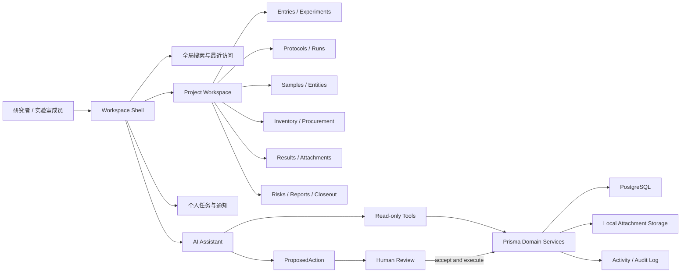
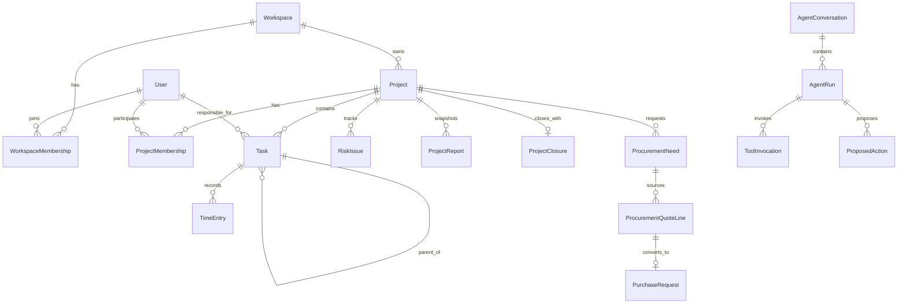

# ADR-0001：泛微项目管理网页架构与 LabNest 转译记录

- 状态：Proposed
- 记录日期：2026-08-08
- 适用范围：LabNest V1 后续架构演进
- 决策类型：信息架构、领域模型、交互边界、AI 治理
- 基准系统：泛微数智化运营平台“项目 / AI 项目采购助手”演示应用

## 1. 结论

LabNest 应采用“工作区壳层 + 项目聚合根 + 领域工作台 + 上下文标签页 + AI 助手侧栏”的五层架构，同时继续坚持当前项目已经确立的 manual-first 数据完整性原则。

核心决策如下：

1. `Project` 是实验、Protocol、样本、库存、结果、采购、文档和活动记录的主要业务上下文，但跨项目对象仍可独立存在。
2. 统一工作区负责全局搜索、最近访问、跨项目入口、个人任务、通知和创建入口；项目工作区负责具体科研执行。
3. 列表、筛选、KPI 和详情采用可深链接的路由与 URL 状态，不照搬基准系统的多层 iframe 实现。
4. AI 助手可以读取授权范围内的数据、调用查询工具并生成 `ProposedAction`，但不得直接修改实验记录、库存、样本、采购或审核状态。
5. 采购、库存、样本和实验执行采用事件或交易账本记录关键变化，避免仅保存不可追溯的最终值。
6. LabNest 不复制企业 ERP 的完整财务、合同和开票能力，只保留科研实验室真正需要的采购证据、预算占用、收货入库、费用归集和可追溯导出。

## 2. 记录目的与证据边界

本文有两个目的：

- 记录目标网页实际呈现的信息架构、交互模式和功能测试结果。
- 将这些模式转译为适合 LabNest 的科研工作区目标架构。

证据分为三层：

- **已观察**：2026-08-08 通过 Computer Use 在已登录演示环境中直接读取或操作的页面内容。
- **合理推断**：由路由、标签页、字段、交互和对象关系推断出的前端或领域边界，不代表已获取对方源代码。
- **目标设计**：结合 LabNest 当前 Next.js、Prisma、PostgreSQL 代码提出的后续架构，不声称泛微平台内部采用相同实现。

本文不是对泛微平台私有后端或内部源码的逆向工程记录。

## 3. 基准网页巡检结果

### 3.1 页面壳层

目标网页呈现四层可见结构：

1. **全局平台壳层**
   - 应用入口“项目”与“更多应用”。
   - 全局关键词搜索。
   - 当前用户、消息和其他平台级入口。
2. **项目应用侧边栏**
   - 项目首页、新建项目、项目管理等顶层模块。
   - 部分模块展开二级导航。
3. **业务内容工作区**
   - 列表、KPI、筛选器、分页、详情链接和新建入口。
   - 通过业务标签页保留多个上下文，例如“项目管理”和“采购需求”。
4. **AI 项目助手**
   - 独立对话区、建议问题、输入区、分析过程和工具调用结果。
   - AI 查询可以打开新的业务标签页，而不是只返回纯文本。

### 3.2 完整信息架构

以下树状结构按巡检中实际显示的导航整理：

```text
项目应用
├── 项目首页
├── 新建项目
├── 项目管理
│   ├── 全部
│   ├── 未开始
│   ├── 进行中
│   └── 已完成
├── 任务管理
│   ├── 我的任务
│   ├── 团队任务
│   ├── 项目任务
│   ├── 全部任务
│   └── 任务统计
├── 项目团队
│   ├── 项目团队
│   ├── 项目成员
│   └── 资源负荷
├── 工时管理
│   ├── 计划工时
│   ├── 实际工时
│   ├── 工时统计
│   └── 报工统计
├── 文档管理
│   ├── 项目文档
│   ├── 任务文档
│   ├── 项目交付物
│   └── 项目单据
├── 项目收支
│   ├── 成本规划
│   ├── 协同开票
│   ├── 合同收款
│   ├── 收入确认
│   ├── 项目收票
│   ├── 合同付款
│   ├── 付款结算
│   ├── 项目成本
│   ├── 工时成本
│   ├── 项目报销
│   ├── 项目采购
│   ├── 预算执行
│   ├── 项目执行
│   ├── 成本归集
│   └── 成本分摊
├── 风险问题
│   ├── 项目风险
│   └── 项目问题
├── 沟通协作
│   ├── 项目群聊
│   ├── 外部协作
│   ├── 项目周报
│   └── 项目月报
├── 项目收尾
│   ├── 项目结项
│   ├── 项目移交
│   ├── 项目收款
│   ├── 验收签署
│   ├── 项目总结
│   ├── 项目核算
│   ├── 验收结案
│   ├── 项目后评估
│   └── 项目案例
├── 项目统计
├── 流程管理
└── 项目集管理
```

“项目统计”“流程管理”“项目集管理”在本次巡检中确认存在于顶层导航，但没有把所有深层页面逐一执行到终态，因此本文不虚构其二级菜单。

### 3.3 项目管理页

已观察的页面能力：

- 状态标签：全部、未开始、进行中、已完成。
- 入口：合同立项。
- 项目名称搜索。
- 项目卡片字段：项目名称、项目编码、关联合同、关键条款、项目类型、负责人、项目金额、状态和进度。
- 结果数量、分页和每页条数。
- 演示数据中存在 8 个项目，状态分布为未开始 1、进行中 6、已完成 1。

页面强调“项目—合同—关键条款—负责人—金额—进度”的一体化视图。对 LabNest 而言，适合保留“项目—研究目标—Protocol—实验—样本—预算—结果”的对应关系，不应照搬销售合同字段。

### 3.4 我的任务页

已观察的页面能力：

- 新建任务和任务名称搜索。
- 视角切换，例如“我负责的”。
- 条件筛选：任务名称、任务类型和更多条件。
- KPI：任务总数、未开始、进行中、已延期、已暂停、已完成。
- 表格字段：任务名称、负责人、任务类型、紧急程度、状态、进度、计划开始时间、计划完成时间、实际开始时间、实际完成时间和上级任务。
- 多选、分页和每页条数。
- 演示视图返回 8 条任务。

这说明任务不是简单待办，而是带负责人、计划、实际、层级、优先级和进度的可汇总执行对象。

### 3.5 AI 项目助手与采购需求页

AI 助手预设了三类任务：

- 核对采购订单、入库单和发票。
- 项目采购需求查询。
- 项目采购任务执行跟踪。

本次执行“项目采购需求查询”后，页面显示：

- 用户问题与时间。
- 可展开的“分析过程”。
- 工具调用记录“查询采购需求”及耗时。
- 结果文本“已为您查找出项目采购需求”。
- 新增“采购需求”业务标签页。

采购需求页包括：

- 条件模式选择器。
- 需求流程、需求物料、申请人和更多条件。
- 重置入口。
- KPI：本月采购数、采购预算总额、采购总额、项目性采购。
- 表格字段：关联项目、关联流程、需求物料、需求数量、库存数量、预计需求金额、总预算、审批状态和申请日期。
- 结果分页和详情链接。

演示页显示 9 条采购需求。该页面最有价值的模式是把“需求、库存、预算、审批和项目”放在同一张可追溯查询表中。

## 4. 功能测试记录

| 测试项 | 操作 | 结果 | 结论 |
|---|---|---|---|
| 页面与登录态 | 打开用户提供的目标 URL | 成功进入项目管理页 | PASS |
| 项目状态筛选 | 切换到“未开始” | 最终返回 1 条未开始项目 | PASS |
| 项目名称搜索 | 输入“软件采购”并触发搜索 | 从 8 条缩小为 1 条 | PASS |
| 搜索重置 | 清空关键词并重新查询 | 可恢复全部视图 | PASS |
| AI 建议问题 | 点击“项目采购需求查询” | 生成问题、分析过程和工具调用 | PASS |
| AI 到业务页联动 | 等待 AI 查询完成 | 新增“采购需求”标签页 | PASS |
| 采购需求数据页 | 读取 KPI、条件和结果表 | 显示 9 条需求和完整字段 | PASS |
| 任务管理 | 展开任务管理并进入“我的任务” | 返回任务 KPI、过滤器和 8 条任务 | PASS |
| 二级导航 | 逐项展开团队、工时、文档、收支、风险、协作和收尾 | 二级菜单可见 | PASS |
| 新建项目/任务 | 未提交表单 | 为避免制造演示业务数据而未执行 | NOT EXECUTED |
| 审批、财务或结项 | 未执行 | 可能改变业务状态，不属于只读巡检 | NOT EXECUTED |
| 删除操作 | 未执行 | 不进行破坏性测试 | NOT EXECUTED |

状态筛选与部分异步页面在点击后需要再次刷新可访问树才能看到最终结果，说明界面存在前端异步数据更新。

## 5. 从基准系统提炼的交互模式

### 5.1 保留的模式

- 全局壳层与项目上下文分离。
- 顶层领域导航加二级视图。
- “搜索/筛选—KPI—表格—详情”的稳定页面模板。
- 列表状态标签与数量提示。
- 业务对象之间使用显式链接。
- AI 对话与业务结果页联动。
- 同一工作区内保留多个上下文标签页。
- 计划值、实际值和状态值并列，便于追踪偏差。

### 5.2 不直接复制的模式

- 不使用多层 iframe 作为 LabNest 的主要路由机制。
- 不复制完整 ERP 财务、开票、收款和合同结算模块。
- 不把“项目进度百分比”作为唯一项目健康指标。
- 不允许 AI 工具直接执行库存、样本、采购或实验记录变更。
- 不把大量业务字段硬编码在一个巨型项目表中。

## 6. LabNest 当前基线

当前仓库已经具备：

- Next.js 16.2.10、React 19.2.7、TypeScript、Tailwind CSS 4。
- Prisma 7.8 与 PostgreSQL 16。
- 项目、Entry、实验、Protocol 与版本、Protocol Run、实验步骤。
- Entity、样本档案、库存位置、库存条目和库存交易。
- 结果、采购请求、询价单、报价行。
- 附件、序列、通用对象链接、建议动作、AI 提供方、参考文献连接器和活动日志。
- 搜索、导出、附件上传和手工 AI 工作台。

当前 UI 仍有部分页面使用 `src/lib/demo-data.ts`，README 也明确把数据库 CRUD、鉴权、备份和连接器列为后续工作。因此，本文描述的是从当前 V1 向可持续 V2 工作区演进的目标，而不是已经完成的实现。

### 6.1 当前路由基线与缺口

当前 `src/app/` 以平铺领域入口为主：

- Dashboard：`/`。
- 记录：`/entries`、`/entries/new`。
- 实验：`/experiments`、`/protocol-run`。
- Protocol：`/protocols`、`/protocols/new`。
- 科研对象：`/entities`、`/samples`、`/sequences`。
- 物资与结果：`/inventory`、`/results`、`/purchases`。
- 治理工具：`/actions`、`/actions/manual`、`/attachments`、`/exports`、`/search`、`/settings`。

主要缺口是尚未形成 `/projects/[projectId]/...` 的项目上下文路由，也缺少统一对象详情路由、个人任务、风险、报告和结项页面。迁移时应保留当前全局入口，同时逐步增加项目内嵌套路由，避免一次性破坏已有链接。

## 7. 目标产品架构



### 7.1 工作区壳层

职责：

- 工作区选择和未来的多用户身份上下文。
- 全局搜索、最近访问、收藏、通知和快速创建。
- 左侧主导航。
- 右侧可折叠 AI 助手。
- 多标签或最近上下文恢复。

约束：

- 主导航只表达稳定领域，不直接暴露数据库表。
- 所有页面有稳定 URL。
- 列表过滤条件写入 URL query，支持刷新、分享和返回。

### 7.2 项目工作区

建议的项目内导航：

```text
Project
├── Overview
├── Entries
├── Experiments
├── Protocols
├── Samples
├── Inventory
├── Results
├── Procurement
├── Tasks
├── Documents
├── Risks & Decisions
├── Reports
└── Closeout
```

项目首页应同时呈现：

- 研究问题、负责人、成员和状态。
- 当前实验和最近记录。
- Protocol 版本与正在运行的 Protocol Run。
- 样本/库存风险。
- 待处理建议动作。
- 采购/收货状态。
- 近期结果和附件。
- 活动日志与关键决策。

### 7.3 标准领域页面模板

列表型领域统一采用：

1. 页面标题与主要动作。
2. 状态标签和数量。
3. 关键筛选器、保存筛选和重置。
4. KPI 摘要，但不替代完整结果。
5. 可排序表格或卡片。
6. 批量选择，仅在存在安全、可撤销操作时启用。
7. 分页、每页条数和总数。
8. 详情抽屉或详情路由。
9. 导出与审计入口。

## 8. 领域模型映射

| 基准系统概念 | LabNest 当前模型 | 目标处理 |
|---|---|---|
| 项目 | `Project` | 保持聚合根，增加 owner、member、日期与健康指标 |
| 项目任务 | `ExperimentStep` 仅覆盖实验步骤 | 新增通用 `Task` 与依赖、层级、负责人、计划/实际日期 |
| 项目成员 | 暂无正式用户模型 | 新增 `User`、`WorkspaceMembership`、`ProjectMembership` |
| 资源负荷 | 暂无 | 从任务计划和工时汇总，不保存不可解释的单一负荷值 |
| 计划/实际工时 | 暂无 | 新增 `TimePlan`、`TimeEntry` 或统一事件模型 |
| 项目文档 | `Attachment`、`AttachmentLink` | 增加文档分类、版本、交付物状态和访问审计 |
| 项目采购 | `ProcurementInquiry`、`ProcurementQuoteLine`、`PurchaseRequest` | 继续轻量科研采购链，补充需求与预算占用 |
| 库存数量 | `InventoryItem`、`InventoryTransaction` | 以交易为真实来源，`currentQuantity` 是可校验快照 |
| 项目风险/问题 | 暂无专用模型 | 新增统一 `RiskIssue`，通过 type 区分 risk/issue |
| 周报/月报 | 暂无 | 新增 `ProjectReport`，保存快照、期间和来源 |
| 项目结项 | `Project.status` 过于粗 | 新增 `ProjectClosure` 和结项检查项 |
| 项目集 | 暂无 | 需要时新增 `Portfolio`，V2 首期不强制 |
| 流程审批 | `ProposedAction`、`ActivityLog` | 扩展为明确的人审决策和执行日志，不建设重型 BPM |
| AI 工具调用 | `AIProvider`、`ProposedAction` | 新增会话、运行和工具调用审计；写操作仍走建议动作 |

### 8.1 建议新增的核心模型



新增模型必须遵守：

- 关键外键可追溯到 `Project`、用户和来源对象。
- 状态使用受控枚举并记录状态变化。
- 金额使用定点小数和明确币种，不能用 `Float` 承载正式财务金额。
- 时间同时保留计划、实际和时区语义。
- AI 生成内容记录来源、模型、提示版本、工具调用和人工决策。

## 9. 路由与页面建议

```text
/
/search
/tasks?scope=mine&status=active
/projects
/projects/new
/projects/[projectId]
/projects/[projectId]/entries
/projects/[projectId]/experiments
/projects/[projectId]/protocols
/projects/[projectId]/samples
/projects/[projectId]/inventory
/projects/[projectId]/results
/projects/[projectId]/procurement
/projects/[projectId]/tasks
/projects/[projectId]/documents
/projects/[projectId]/risks
/projects/[projectId]/reports
/projects/[projectId]/closeout
/actions
/attachments
/exports
/settings
```

列表详情建议采用嵌套路由或独立详情页，而不是把所有对象堆在一个页面组件中。

## 10. 服务边界

建议把业务逻辑放在领域服务而不是页面组件中：

- `project-service`：项目状态、成员、概览汇总和结项。
- `task-service`：任务层级、依赖、负责人、计划和实际进度。
- `protocol-service`：版本、参数、运行和不可变历史。
- `sample-service`：样本身份、谱系、生命周期和 aliquot。
- `inventory-service`：交易、余额校验、位置和预警。
- `procurement-service`：需求、询价、选择、采购、收货和入库。
- `attachment-service`：二进制存储、元数据、链接和下载授权。
- `search-service`：跨对象检索、筛选和权限裁剪。
- `agent-service`：会话、工具策略、读取范围、建议动作和审计。

所有跨多个写操作的流程应使用 Prisma transaction，并为重复提交提供幂等保护。

## 11. AI 助手治理

### 11.1 允许直接执行

- 读取当前用户有权访问的数据。
- 汇总项目、实验、Protocol、样本、库存、采购和结果。
- 生成筛选条件并打开业务结果页。
- 生成草稿、检查清单、差异说明和待办建议。
- 运行纯计算和格式转换。

### 11.2 必须生成人工审核动作

- 创建或更新实验。
- 消耗、调整、转移或报废库存。
- 创建采购请求或执行收货入库。
- 关联或移动关键样本。
- 更改 Protocol 正式版本。
- 更改项目结项、审核或归档状态。

### 11.3 禁止默认执行

- 删除不可恢复记录。
- 覆盖历史版本。
- 根据 AI 结论自动改变临床、样本或实验决策。
- 未经权限裁剪把项目内容发送到外部模型。

## 12. 数据完整性与审计

- ProtocolVersion 一旦被实验引用，不允许原地修改。
- Experiment 保存实际使用的 ProtocolVersion。
- 库存变化必须对应 `InventoryTransaction`。
- 样本状态变化必须对应 `SampleLifecycleEvent`。
- 采购报价选择保留未选择原因，不只保存中标项。
- 附件二进制、元数据和对象链接分别管理。
- 所有 AI 建议保存生成来源、payload、人工决策和执行结果。
- ActivityLog 记录谁在何时对什么对象执行了什么动作。
- 导出必须保留完整结果和关键统计量，避免只导出“显著”或“已选”数据。

## 13. 安全、隐私与权限

V2 在多用户化之前不能把演示环境的“所有人可见”模式带入真实科研数据。

最低要求：

- 工作区级和项目级 RBAC。
- 服务端权限校验，不依赖隐藏按钮。
- 附件下载鉴权与路径安全。
- API key 或连接器凭据加密存储。
- 对患者、受试者和临床样本标识进行脱敏或哈希化。
- 审计登录、导出、下载、共享和敏感字段访问。
- 外部 AI 默认最小化传输，并显示将发送的数据范围。

## 14. 可观测性与质量门槛

每个关键工作流应提供：

- 结构化日志与请求/任务关联 ID。
- 领域错误码和可理解错误信息。
- 数据库约束、Zod 输入校验和服务层断言。
- 关键查询耗时与失败率。
- AI 工具调用耗时、结果数量、失败原因和人工采纳率。
- 完整结果表、导出文件和必要的质控报告。

最低自动化测试：

- 领域单元测试。
- Prisma 集成测试。
- 权限矩阵测试。
- 搜索与筛选契约测试。
- Protocol 版本不可变测试。
- 库存余额与交易一致性测试。
- 采购需求到收货入库的端到端测试。
- AI 建议动作不能绕过人工审核的安全测试。
- Playwright 关键路径测试。

## 15. 分阶段实施

### Phase 1：统一工作区与真实数据读取

- 将核心页面从 demo data 切换为 Prisma 查询。
- 建立统一项目工作区布局和稳定路由。
- 完成项目、实验、Protocol、样本、库存、结果和采购的只读详情。
- 统一列表筛选、分页、空状态、错误状态和导出。

### Phase 2：安全 CRUD 与任务层

- 建立正式的 Server Actions/API 输入边界。
- 新增 User、Membership、Task、RiskIssue 和 Report。
- 完成创建、编辑、归档和审计。
- 把附件、活动日志和对象链接接入各领域页面。

### Phase 3：采购—库存—实验闭环

- 新增 ProcurementNeed 与预算占用。
- 打通需求、询价、选择、采购、收货、入库和实验消耗。
- 建立数量和金额的一致性检查。
- 输出可复核的采购与库存报告。

### Phase 4：受控 AI 工作区

- 建立 AgentConversation、AgentRun 和 ToolInvocation。
- 首先开放只读查询工具。
- AI 查询结果以业务标签页或保存筛选呈现。
- 所有写入能力经 `ProposedAction` 和人工审核。

### Phase 5：多用户、备份与部署

- RBAC、敏感数据策略和连接器凭据管理。
- PostgreSQL、附件和配置的自动备份及恢复演练。
- 生产 HTTPS、迁移、健康检查和监控。
- 根据真实使用再决定是否引入 Portfolio 和更复杂审批。

## 16. 验收标准

本 ADR 对应的架构演进完成时，应满足：

- 任何核心科研对象都能从项目或全局搜索进入。
- 列表过滤可复制 URL 并在刷新后恢复。
- Project 页面能汇总实验、Protocol、样本、库存、结果、采购和风险。
- Protocol、样本和库存历史可追溯且不可被静默覆盖。
- 采购需求可以看到库存、预算、审批和入库状态。
- AI 查询能打开真实业务结果页。
- AI 写入不能绕过人工审核。
- 所有关键写操作有 actor、时间、来源和目标对象审计。
- 数据库、附件和环境配置均有可验证备份。
- 测试、类型检查、lint 和生产构建全部通过。

## 17. 当前限制与后续验证

- 本次巡检基于演示租户和当前账号权限，不能证明其他角色、管理员后台或隐藏配置的完整范围。
- 未执行会创建、审批、结算、结项或删除业务数据的操作。
- 未获取对方源码、数据库结构、接口契约和真实权限模型。
- 项目统计、流程管理和项目集管理的全部深层页面需要在后续只读巡检中补充。
- 本文记录的是泛微演示网页的可见产品架构，并将其中适用的模式转译为 LabNest 目标设计；不把界面观察等同于泛微平台的真实技术实现。

## 18. 相关本地文件

- `README.md`
- `package.json`
- `prisma/schema.prisma`
- `src/app/`
- `src/lib/demo-data.ts`
- `src/lib/protocol.ts`
- `src/lib/inventory.ts`
- `src/lib/procurement.ts`
- `src/lib/samples.ts`
- `src/lib/attachments.ts`
- `src/lib/search.ts`
- `src/lib/ai.ts`
