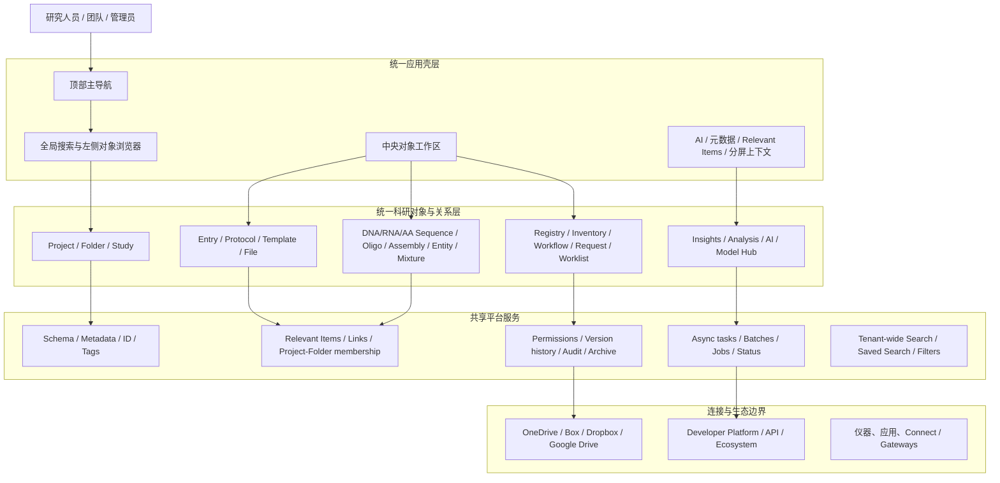
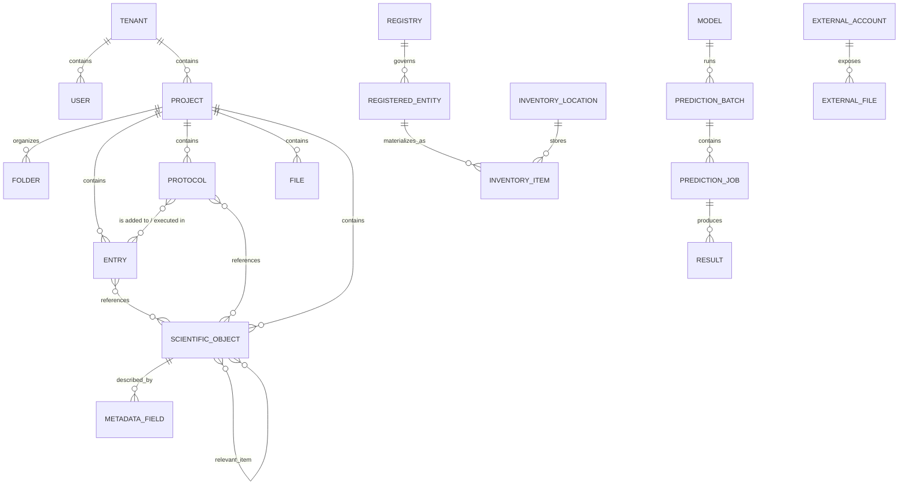
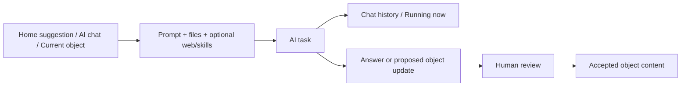
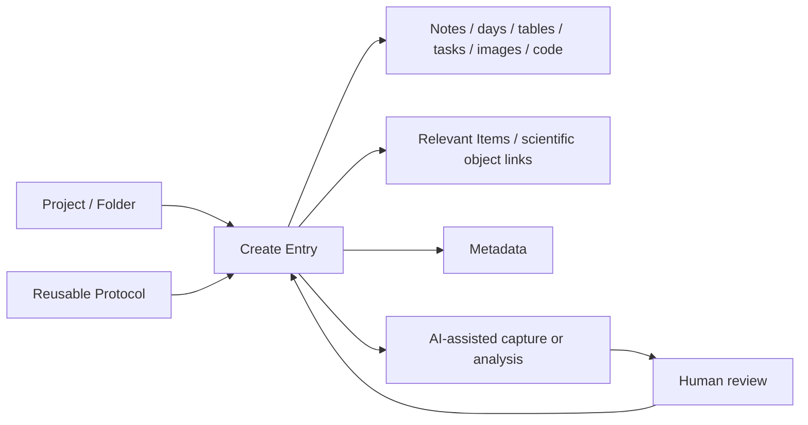
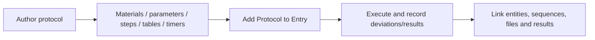
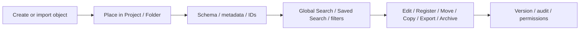
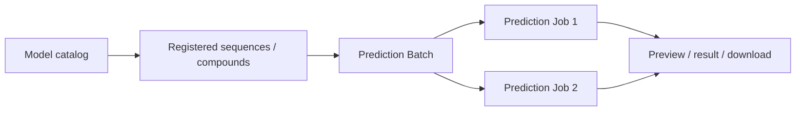

# Benchling 架构记录

> 调研日期：2026-08-08（Asia/Shanghai）
>
> 调研入口：[Benchling Home](https://benchling.com/editor/homepage)
>
> 调研方式：在已登录的 Benchling 学术工作区内，通过界面逐页查看并进行只读或低风险交互测试；同时用 Benchling 官方帮助中心和公开产品页补齐租户未启用的模块。
>
> 文档性质：产品/信息/领域架构记录，不是对 Benchling 私有后端实现、数据库表或源代码的逆向说明。

## 1. 结论摘要

Benchling 不是一个单独的电子实验记录本，而是一个以“统一科研对象模型”为底座的云端研发平台。它把项目与文件夹、实验记录、协议、分子序列、注册实体、库存、工作流、请求、分析、AI、模型运行和外部连接组织在同一套导航、搜索、权限、版本和关联体系中。

本次实测最明确的架构特征是：

1. **统一应用壳层**：顶部主导航负责跨模块切换；左侧浏览/搜索区域负责对象发现；中央工作区负责编辑或分析；右侧或分屏区域承载 AI、元数据、相关对象等上下文工具。
2. **对象优先，而不是页面优先**：Entry、Protocol、DNA/RNA/AA Sequence、Oligo、Assembly、Entity、Mixture、Template 等都是可搜索、可移动、可复制、可归档、可导出、可关联的持久对象。
3. **记录与规范分离**：Protocol 是可复用的方法规范；Entry 是一次具体实验或日常记录。协议可以被加入记录，但二者不是同一种对象。
4. **跨对象关系是一等能力**：Relevant Items、元数据、项目/文件夹归属、对象链接和分屏工作区把记录、协议、序列、文件和结果连接成可追溯网络。
5. **结构化数据与富文本并存**：Notebook 同时支持日期分段、文本、任务框、表格公式、图片注释、代码块和文件；Protocol 同时支持步骤、材料、结构化表格、公式和计时器；Sequence 则提供序列、注释、酶切位点和多种图谱视图。
6. **AI 是横向能力，不是独立数据孤岛**：AI 既有独立聊天入口，也可把当前 Entry 作为上下文；任务状态回流到 Home 的 Running now。界面明确提示 AI 可能出错，需要人工检查更新。
7. **计算任务采用异步作业模型**：Model Hub 的核心关系是 Model → Prediction Batch → Prediction Job → Result，适合长耗时、GPU 或批量推理。
8. **连接器是明确的系统边界**：External data 把 OneDrive、Box、Dropbox、Google Drive 等外部文件源放在独立连接层；连接操作会产生 OAuth 持久授权，因此本次只核对入口，未授权。
9. **租户配置决定表面模块**：当前学术工作区只显示 Home、AI、Projects、Search、Create、Model Hub、External data 和 Explore Benchling；官方导航还包含 Studies、Registry、Inventory、Workflows、Requests、Insights、Connections 等常见应用。

因此，“完整架构”应分两层理解：第一层是本账户当前可见、已实测的租户架构；第二层是官方说明的可配置平台架构。不能因为当前租户没有显示 Registry 或 Inventory，就推断 Benchling 平台没有这些模块。

## 2. 证据标记与测试边界

本文使用以下标记：

- **[实测]**：在当前登录工作区中实际打开并读取界面，或完成低风险、可逆交互。
- **[官方]**：来自 Benchling 官方帮助中心或公开产品页。
- **[推断]**：根据多个界面之间的关系形成的架构判断，不声称是私有后端实现。
- **[未执行]**：入口和流程已确认，但因会产生持久数据、权限、共享、删除或 OAuth 授权而没有继续。

测试遵循“先读取、后交互、避免污染工作区”的原则。本次没有创建项目、Entry、Protocol、Sequence 或注册实体，没有修改正文或序列，没有归档/删除/移动对象，没有共享数据，也没有连接第三方云盘。

唯一产生的新持久对象是一个低风险的 Benchling AI 测试聊天，提示词为：

> Briefly list the task categories that Benchling AI can help with in this interface.

该任务完成后以 `Benchling AI Task Categories Overview` 出现在 Home 的 Running now 和聊天历史中。它没有被要求修改任何实验数据。

## 3. 平台总体架构



这张图表达的是产品与领域层关系。`统一科研对象与关系层`、`共享平台服务` 等名称是本次调研的抽象，不代表 Benchling 对其内部微服务或数据库采用了相同命名。

## 4. 信息架构

### 4.1 当前租户的主导航树 [实测]

```text
Benchling
├── Home
│   ├── AI suggestions
│   ├── Jump back in
│   ├── My Calendar
│   ├── Explore Molecular Biology
│   ├── Explore the Notebook
│   └── Running now
├── AI
│   ├── Chat history
│   ├── New chat
│   ├── Capture data
│   ├── Analyze data
│   ├── Design experiments
│   ├── Generate hypotheses
│   ├── Write reports
│   ├── Files / Photos
│   ├── Web search
│   └── Skills
├── Projects
│   ├── Saved Searches
│   ├── Create project
│   ├── All projects / My projects / Shared with me / Group
│   └── Active-state filter
├── Search
│   ├── Saved Searches
│   ├── Keyword search
│   ├── Type / Folder / Filters
│   ├── Result columns
│   └── Bulk actions
├── Create
│   ├── Project
│   ├── Entry
│   ├── Protocol
│   ├── DNA / RNA sequence
│   ├── AA sequence
│   ├── Oligo
│   ├── Assembly
│   ├── CRISPR
│   ├── Entity from schema
│   ├── Mixture
│   ├── Template
│   └── More
├── Model Hub
│   ├── Models
│   ├── Prediction Batches
│   └── Prediction Jobs
├── External data
│   └── External Files / Add account
├── Explore Benchling
└── User avatar / account settings
```

### 4.2 官方可配置的常见应用 [官方]

Benchling 官方导航说明还列出：

- **Studies**：研究概览、关联对象、结果和元数据。
- **Registry**：注册实体与全局 Registry Search。
- **Inventory**：库存位置、库存对象和库存搜索。
- **Workflows**：任务创建与执行。
- **Requests**：请求模板和请求看板。
- **Insights**：基于 SQL 或 Analysis table 的分析和仪表板。
- **Connections**：Connect 网关、外部文件、应用和其他集成。
- **Worklists / My Work**：Entry、Worksheet、Task 及状态筛选。

这些应用是否出现在顶部导航取决于租户配置、许可、角色和权限。当前账户未显示，不应写成“已实测可用”。

### 4.3 官方产品组合视图 [官方]

Benchling 公开产品页在租户应用之上还提供一层面向采购和解决方案的产品分类：

- **Suites**：Bioresearch、Bioprocess、Automation、Biologics、In Vivo、Benchling AI、Connect、Insights、PipeBio、Validated Cloud。
- **Platform**：Platform Overview、Validated Cloud、Developer Platform、Ecosystem。
- **Core capabilities**：Lab Notebook、LIMS、Molecular Biology、Registry、Workflows、Inventory。
- **Connected laboratory**：应用、仪器、网关和数据连接。
- **Services**：客户成功和专业服务。

该分类与登录后的顶部导航不是一一对应关系。例如 Bioresearch 是产品套件，Entry/Protocol/Registry 是套件中的应用或能力；Developer Platform 是扩展层，不是普通研究人员每天编辑实验的页面。

## 5. 用户界面架构

Benchling 的多个页面复用了同一组交互骨架：

| 层 | 职责 | 实测表现 |
|---|---|---|
| 顶部主导航 | 跨应用切换、全局创建、账户入口 | Home、AI、Projects、Search、Create、Model Hub、External data |
| 左侧对象/搜索面板 | 当前结果集、最近对象、文件浏览、定位 | Entry、Protocol、Sequence 页面均保留对象浏览上下文 |
| 中央工作区 | 对象主内容、编辑、分析、图谱 | Notebook 编辑器、Protocol 编辑器、Sequence Map、Model 列表 |
| 对象级页签 | 一个对象的不同投影 | Entry 的 Notes/Relevant Items/Metadata；Sequence 的图谱/描述/元数据等 |
| 上下文侧栏 | AI、聊天、元数据、相关项、搜索结果 | Entry 可把当前文档交给 AI；Search 可保持结果集 |
| 底部/辅助工具 | 快捷键、Assembly、Split workspace 等 | Protocol、Entry、Sequence 均出现分屏入口 |

最关键的设计不是某个按钮，而是**在对象工作区中仍保留对象发现和跨对象上下文**。这使用户不必在“浏览列表”和“处理对象”之间反复跳出整个应用。

## 6. 核心领域对象

### 6.1 概念对象模型



这是从界面和官方产品说明提炼出的概念模型，不是 Benchling 私有数据库的精确 ER 图。

### 6.2 对象类别与职责

| 对象 | 核心职责 | 主要能力 |
|---|---|---|
| Project / Folder | 组织、权限和协作边界 | 创建、筛选、共享、移动、归档 |
| Entry | 一次具体实验或日常记录 | 日期分段、富文本、表格公式、任务、图片注释、代码块、文件、对象链接 |
| Protocol | 可复用、可执行的方法规范 | 材料、步骤、结构化表格、公式、计时器、元数据、相关项 |
| Sequence | 分子序列对象 | 碱基检索、注释、翻译、引物、酶切位点、线性/质粒图、分析、导出 |
| Entity / Mixture | 结构化研发对象 | Schema 驱动创建、元数据、注册、关联 |
| Template / Collection | 规范化数据采集 | 复用结构、约束记录格式 |
| Request / Workflow / Worklist | 任务与流程编排 | 请求、执行、状态和责任分配 |
| Registry | 唯一身份和受控实体集合 | 注册、ID、Schema、全局检索 |
| Inventory | 实体的物理存量和位置 | 位置、对象、搜索、移动/消耗等操作 |
| Result / Insight | 分析结果与决策呈现 | 结构化结果、SQL/分析表、看板 |
| Model / Batch / Job | 科学 AI 推理 | 模型发现、单次/批量运行、状态跟踪、结果下载 |
| External Account/File | 外部数据边界 | OAuth 连接、外部文件发现和引用 |

## 7. 功能模块记录

### 7.1 Home [实测]

Home 是个性化工作台，而不只是静态欢迎页：

- `AI suggestions` 提供 Transcribe handwritten notes、Import data from file、Create and fill a notebook entry、Run statistical analysis、Chart and plot results、Something else 等任务入口。
- `Jump back in` 聚合最近对象。
- `My Calendar` 与 Notebook 中的实验日期相互呼应。
- `Running now` 显示异步任务状态；本次 AI 测试完成后确实回流到该区域。
- `Explore Molecular Biology` 和 `Explore the Notebook` 是产品引导入口。
- 页面提示可切回 legacy homepage，并提供反馈链接。

[官方] Home 还可包含 Worklists、My Work 的 Entries/Worksheets/Tasks 以及状态筛选；具体显示受租户配置影响。

### 7.2 AI [实测]

AI 同时具有两种形态：

1. **独立 AI 工作区**：聊天历史、新聊天、通用输入框、任务类别、附件、Web search 和 Skills。
2. **对象内 AI 侧栏**：在 Example Entry 页面中，当前 Entry 被自动带入为上下文，界面提供“如何审查 AI 对此 Entry 的更新”说明。

AI 的架构闭环为：



界面明确提示：`AI can make mistakes. Always check results.` 因此 AI 输出在产品语义上不是自动可信事实。

### 7.3 Projects [实测]

当前工作区有两个项目：`Anna Zhu Lab Shared Project` 和 `Example Project`。列表提供名称、创建日期和描述；过滤可切换 All projects、My projects、Shared with me、用户组及活动状态。

[推断] Project 是组织和访问控制的首要边界，Folder 是其下的局部层级。对象 URL 也包含 project/folder 与对象 ID，进一步支持这一判断。

### 7.4 Search [实测]

Search 是跨对象、跨项目的租户级发现入口。默认查询涵盖：

- Project / Folder
- DNA/RNA/AA Sequence
- Oligo / RNA Oligo
- Mixture
- Entry
- Protocol
- Request Submission / Definition
- Sequence Analysis / Protein Alignment
- Bulk Assembly
- Worklist
- Template / Subtemplate / Form Definition / Template Collection
- Pipeline File

类型下拉进一步按 Project or Folder、Entity、Entry、Template Collection、Template、Request、Assembly、File、Protocol、DNA/RNA Alignment、AA Alignment、Worklist 等类别过滤。

结果表支持列筛选，并提供 Edit properties、Register、Move to folder、Copy to folder、Archive、Export、More 等批量操作。实测使用 `pBR322_EGFR` 完成精确搜索，结果从 26 个当前对象收敛到 1 个，并成功打开对应 DNA 序列。

### 7.5 Notebook Entry [实测]

Example Entry 展示了 Notebook 的混合记录能力：

- Notes、Relevant Items、Metadata 和附件页签。
- `Add Protocol` 将方法规范带入具体记录。
- 日期分段；新增日期可映射到 Home Calendar。
- 富文本、任务复选框、表格和公式。
- 通过 `@` 或从左侧浏览器拖拽链接其他 Benchling 对象。
- 图片内联和 Annotate image。
- 代码块与普通实验记录并置。
- 文件拖放区域。
- Share、More actions、Visibility、Keyboard shortcuts、Split workspace。
- AI tools 和以当前 Entry 为上下文的 AI 侧栏。

本次点击 `Edit contents` 验证编辑模式和工具栏可以进入，但没有更改文本、勾选任务或保存新内容。

### 7.6 Protocol [实测]

在 `Sequential Double Digest` 中观察到：

- Protocol、Metadata、Relevant Items 三类对象投影。
- 标题、Introduction、Materials、Procedure 和编号步骤。
- 结构化表格支持 CSV 下载、文本格式、颜色、对齐、合并、设置、公式和增删行。
- 内嵌计时器。
- Share、Discuss、Move to folder、Archive、Visibility 和 Split workspace。
- Relevant Items 表以 Item、Reference、Modified at、Project folder 展示关联对象。

示例表格中出现一个 `#VALUE!` 公式错误，这说明结构化计算能力存在，同时也说明表格公式仍需要用户质控；系统没有把错误悄悄吞掉。

### 7.7 Molecular Biology / Sequence [实测]

`pBR322_EGFR` DNA 序列对象包含 5968 bases。实测界面包括：

- Sequence Map、Linear Map、Plasmid、Description、Metadata、Entity Map。
- 在 bases、annotations、translations、primers 之间搜索。
- 碱基序列、编号、限制性酶位点和翻译信息共同显示。
- Zoom、Create、Analyze、Copy、Create PDF、Visibility。
- Share、Copy to、Fit view、Center on main entity。
- Assembly 和 Split workspace。

这表明分子生物学对象不是附件，而是具有专用编辑/分析视图和可计算语义的一等领域对象。

### 7.8 Model Hub [实测 + 官方]

Model Hub 有三个稳定层级：

- **Models**：模型目录与说明。
- **Prediction Batches**：一次批量运行，列包括 Name、Status、Model、Creator、Created、Modified、Num Jobs。
- **Prediction Jobs**：批次内具体任务，列包括 Components、Status、Prediction Batch、Model、Created、Modified、Preview、Results、Config。

当前模型目录显示 101 个条目范围，界面中可见 BoltzGen、AlphaFold2、Boltz-1、Boltz-2、Chai-1、ESMFold2、ESMFold2-Fast、IntelliFold V2、OpenDDE、OpenFold、OpenFold3、Protenix-v1、SimpleFold 等。每个卡片带类别、描述、Reference 和 Run Batch。

[官方] Model Hub 支持选择已注册的序列/化合物、单次或批量运行、Prediction Batch 下的 Prediction Jobs、结果下载及 GPU 加速 MSA；管理员通过 Tenant Admin Console 控制，Validated Cloud 不提供该能力。

当前账户没有 Prediction Batch 或 Prediction Job。本次没有运行模型，因为这可能产生计算成本和持久任务。

需要注意：官方帮助页列出的 GA 模型较少，而当前 UI 已显示更多模型和更丰富的目录，因此**实际租户 UI 比帮助页更新**；模型清单应以目标租户实时界面为准。

### 7.9 External data / Connections [实测 + 官方]

当前 External Files 的 `Add account` 对话框显示：

- OneDrive
- Box
- Dropbox
- Google Drive

四类账户当前均为 `No accounts connected`，并提供 Connect。因为 Connect 会创建持续性的 OAuth 数据访问授权，本次停在对话框层，没有继续。

官方导航把 Connections 描述为 Connect Gateways、External files 和 Apps 的统一连接空间。官方页面同时提示新的 Google Drive connection 可能受 Google 政策限制；这与当前 UI 仍显示 Google Drive 入口并不完全一致。应将其记录为“入口可见，但连接可用性未验证”，不能仅凭按钮存在断言可成功连接。

## 8. 关键业务工作流

### 8.1 实验记录工作流



### 8.2 协议复用工作流



### 8.3 数据发现与治理工作流



### 8.4 科学模型运行工作流



## 9. 横向平台能力

### 9.1 权限与协作

[实测] 多个对象具备 Share、Visibility、Move to folder、Copy to 等入口，Projects 具备 My projects、Shared with me 和用户组过滤。

[推断] 权限至少由租户、用户/组、项目/文件夹和对象可见性共同组成。未进入管理员控制台，因此本文不声称已验证具体角色矩阵、继承规则或字段级权限。

### 9.2 版本、自动保存和可追溯性

[官方] Benchling 为云端产品，不支持离线模式或本地服务器安装；桌面浏览器是主要体验，移动端不保证完整支持。内容每隔数秒自动保存，数据具有版本控制。官方页面还说明提供最近五周的增量备份和月度备份。

[实测] Entry、Protocol 和 Sequence 都显示对象级元数据、修改时间或关联信息；Search 能按对象类型、文件夹和多种列发现对象。

自动保存并不等于数据质量保证。Protocol 示例中的 `#VALUE!` 说明公式错误仍需要用户检查；AI 侧栏的错误提示也把最终责任留给使用者。

### 9.3 文件与附件

[实测] Entry 支持文件拖放、图片内联/注释以及附件页签；External data 单独管理外部文件账户。

[官方] 学术版单个附件上限为 128 MB；企业版默认 2 GB，且可配置。外部系统和数据仓库连接由 Account Settings 管理。

### 9.4 搜索与可发现性

Search 不是简单标题检索，而是结合对象类型、Folder、过滤器、列、保存查询和批量动作的统一工作台。对象编辑页仍保留搜索结果或左侧浏览器上下文，使“找到对象”和“处理对象”形成连续流程。

## 10. 实测矩阵

| 区域 | 测试动作 | 结果 | 数据影响 |
|---|---|---|---|
| Home | 查看所有可见分区和最近对象 | 通过 | 无 |
| AI | 打开任务类别、更多选项，提交通用问题 | 通过；任务完成并进入 Running now | 新增一个非敏感聊天 |
| Projects | 查看项目、Saved Searches、项目/状态过滤 | 通过 | 无 |
| Search | 查看类型、Folder、Filters、列和批量动作 | 通过 | 无 |
| Search | 精确搜索 `pBR322_EGFR` 并打开结果 | 通过；26 个对象收敛到 1 个 | 无 |
| Create | 展开全局创建菜单并记录对象类型 | 通过 | 未创建对象 |
| Entry | 打开 Example Entry、页签和 Edit contents | 通过 | 仅进入编辑模式，未修改内容 |
| Entry AI | 查看当前 Entry 上下文和审查提示 | 通过 | 无 |
| Protocol | 打开 Protocol/Metadata/Relevant Items | 通过 | 无 |
| Protocol | 检查结构化表格、公式、计时器和分屏入口 | 通过 | 无 |
| Sequence | 打开 pBR322_EGFR 并检查多个视图和工具栏 | 通过 | 无 |
| Model Hub | 查看 Models/Batches/Jobs 和模型卡片 | 通过 | 未运行模型 |
| External data | 打开 Add account 并核对提供商 | 通过 | 未建立 OAuth 授权 |
| Share/Visibility | 确认入口存在 | 部分验证 | 未改变权限 |
| Move/Copy/Register/Archive/Export | 确认批量入口存在 | 部分验证 | 未执行持久操作 |
| Registry/Inventory/Studies/Workflow/Requests/Insights | 用官方资料补齐 | 当前租户不可见 | 未实测租户功能 |
| 第三方云盘连接 | 核对连接对话框 | 入口通过 | 未授权，实际可用性未知 |
| Model inference | 核对目录、Batch/Job 结构 | 入口通过 | 未消耗计算资源 |

## 11. 实测与官方资料之间的差异

1. **租户模块差异**：官方列出 Studies、Registry、Inventory、Workflows、Requests、Insights、Connections；当前学术工作区顶部未显示这些模块。
2. **Model Hub 清单差异**：官方帮助页只列出部分 GA/Preview 模型；当前实时 UI 已有更多模型，因此帮助页可能滞后。
3. **Google Drive 差异**：当前 External Files 对话框显示 Google Drive；官方导航页提示新的 Google Drive 连接受政策限制。只能确认“入口存在”，不能确认新授权必然成功。
4. **首页差异**：官方 Home 描述包含 My Work、Worklists 等；当前首页主要显示 AI suggestions、Jump back in、Calendar、探索入口和 Running now。

这些差异说明 Benchling 是持续演进且强租户配置的平台。做产品复刻或迁移设计时，应保存“观察日期、租户类型、角色、许可证和界面版本”，避免把某次截图当成永久产品规范。

## 12. 对 LabNest 的架构借鉴

LabNest 当前已经具备 Project、Entry、Experiment、Protocol/ProtocolVersion、Entity、Sequence、Inventory、Sample、Result、Attachment、ProposedAction、Search、Purchase 和连接器占位等领域基础。Benchling 的价值不在于照搬其页面，而在于把这些对象统一起来。

建议按以下优先级借鉴：

### P0：统一对象壳层和对象身份

- 为所有核心对象使用稳定 ID、对象类型、标题、Project/Folder、状态、创建/修改信息。
- 在统一 AppShell 中保持全局 Create、Search 和最近对象。
- 对象详情页采用一致的 Header、Metadata、Relevant Items、Activity/Version 和 Share/Visibility 区域。

### P0：数据库驱动的全局搜索与关系图

- 从当前 demo search index 迁移到 PostgreSQL 查询。
- 统一搜索 Entry、Experiment、Protocol、Entity、Sample、Inventory、Result、Purchase、Sequence、Attachment。
- 把 `ItemLink`/`AttachmentLink` 提升为核心关系基础设施，为 Relevant Items、引用来源和实验追溯提供同一套 API。

### P0：记录、协议和执行实例分层

- 保持 `Protocol`、`ProtocolVersion`、`ProtocolRun`、`Experiment`、`Entry` 的职责分离。
- 实验必须保存使用的精确 ProtocolVersion，避免协议更新后历史记录漂移。
- 在 Entry/Experiment 中允许“嵌入协议运行”，但不要把协议模板直接改写为实验记录。

### P1：可追溯操作而不是直接改状态

- 继续坚持库存由 `InventoryTransaction` 改变数量。
- AI 与计算只生成 `ProposedAction`，人工接受/编辑/拒绝后才执行。
- 为批量编辑、移动、注册、导出和归档增加 ActivityLog 与操作者信息。

### P1：结构化与非结构化记录共存

- Entry 保留自由文本、图片、附件和代码块。
- Protocol/Experiment 增加结构化参数、表格、步骤、计时器和结果模板。
- 公式必须显示错误状态并可追溯输入，不能用静默空值掩盖失败。

### P1：异步任务模型

- 为 AI 解析、导出、批量导入、序列分析等长任务建立 `Task/Batch/Job` 状态模型。
- Dashboard 的 Running now 只做状态投影，任务记录本身应持久化并可审计。

### P2：注册实体与库存物理实例分离

- `Entity` 表示标准化的科学身份；`InventoryItem` 表示某个实体在具体位置、批次和数量下的物理实例。
- `SampleProfile` 保持生物学来源身份，vial/aliquot 继续落在库存对象和生命周期事件中。

### P2：连接器作为边界上下文

- Zotero/EndNote、外部文件、仪器和 AI provider 不应直接侵入核心对象表。
- 使用 `ReferenceConnector`/provider adapter 处理凭证、同步和外部 ID；核心记录只保存明确的引用和同步状态。

### 不建议直接复制

- 不要为了“像 Benchling”一次性堆叠大量空模块。
- 不要把企业级审批、复杂管理员矩阵和高成本 AI 推理提前带入个人/小团队 V1。
- 不要让 AI 直接写入实验、库存或采购核心记录。
- 不要用富文本替代所有结构化字段，也不要用结构化表单消灭科研记录的自由叙述。

## 13. 局限性

- 本次没有管理员权限，不能验证 Tenant Admin Console、角色矩阵、SSO、审计日志导出和企业策略。
- 当前是学术工作区，未显示的企业模块主要依据官方资料记录。
- 未执行任何会改权限、归档、删除、注册、移动、复制、导出大批数据或创建第三方授权的操作。
- 未运行 Model Hub 模型，因此没有验证队列、GPU 用量、失败重试、计费和结果文件格式。
- 未连接外部文件账户，因此没有验证同步方向、冲突处理、权限映射和断开连接后的行为。
- 没有检查 Benchling 私有 API、网络请求、数据库或源代码；本文不能证明其内部技术栈或微服务拓扑。
- Benchling 会持续更新，模型目录、首页和连接器可用性可能变化。

## 14. 来源

- [Benchling Home（登录后）](https://benchling.com/editor/homepage)
- [Navigate your Benchling account](https://help.benchling.com/hc/en-us/articles/9684267691021-Navigate-your-Benchling-account)
- [Run Scientific AI models in Benchling with Model Hub](https://help.benchling.com/hc/en-us/articles/45774533344781-Run-Scientific-AI-models-in-Benchling-with-Model-Hub)
- [Benchling public product site](https://www.benchling.com/)

## 15. 一句话架构定义

**Benchling 是以统一科研对象、关系、搜索、权限和版本为数据底座，以 Notebook、Molecular Biology、Registry、Inventory、Workflow、Insights、AI、Model Hub 与 Connections 为可配置应用层的云端生命科学研发平台。**
