# Labguru ELN–LIMS 架构记录

> 调研日期：2026-08-08
>
> 入口：[Cenevo YouTube 频道](https://www.youtube.com/@Cenevo)
>
> 调研方法：公开视频逐段观察、Labguru 官方产品页与帮助中心交叉核对、与 LabNest 当前领域模型对照
>
> 文档性质：竞争产品的可观察产品架构、领域架构与部署边界记录；不是 Labguru 私有源代码或数据库的逆向工程

## 1. 结论摘要

Labguru 的核心不是一个单独的“电子实验记录本”，而是一个以共享科研对象为中心、将 ELN、LIMS、库存、设备、自动化、协作和合规治理组合在同一工作空间中的科研运营平台。

从公开视频和官方资料可以较可靠地重建出以下架构主线：

1. **统一工作空间**：用户、项目、实验、协议、样本、库存、设备和附件在同一账户边界内协作。
2. **ELN 研究层级**：`Project → Folder/Subfolder → Experiment → Section/Element`。
3. **协议模板机制**：Protocol 是可复用模板；用协议发起实验时，内容被复制进 Experiment，后续实验记录不会反向修改原协议。
4. **LIMS 双层对象模型**：Inventory Item 表示样本、试剂或材料的定义；Stock 表示真实存在、具有数量、位置、批次和状态的物理份额。
5. **存储与身份标识**：Stock 放入分层 Storage；条码、二维码或 DataMatrix 将数字记录与冰箱、盒、孔位和标签连接。
6. **谱系与过程事件**：消耗、移动、拆分、复制和 pooling 不应只改一个当前值，而应形成带时间、数量、操作者和父子关系的事件历史。
7. **自动化层**：Workflow Editor 通过触发器、顺序/并行/条件步骤、变量、密钥和 API 将 Labguru 数据库与仪器及外部系统连接。
8. **治理层**：角色、所有权、权限、版本、历史、软删除、签名和见证构成合规记录链。
9. **部署层**：官方公开的是 AWS 公有多租户和私有单租户两种云形态，以及关系数据与对象文件的分离；核心后端语言、数据库引擎和内部服务拓扑并未公开。

因此，本文能给出的最强结论是 **Labguru 的产品、领域、信息、流程、集成、治理和公开部署架构**。不能据此断言其私有代码采用某种框架、某一种 SQL 数据库、微服务数量、消息队列或缓存产品。

## 2. 证据标记与边界

本文使用四类标记：

- `[视频]`：直接出现在 Cenevo 公开视频界面、章节或演示流程中。
- `[官方]`：由 Labguru 官网、官方帮助中心或安全资料明确说明。
- `[推断]`：为解释多个可观察行为而提出的合理领域或系统设计，不等同于厂商内部实现。
- `[未知]`：公开资料不足，不能可靠判断。

### 2.1 可以确认的内容

- 用户可见的模块边界、页面层级与主要操作流程。
- Project、Folder、Experiment、Protocol、Inventory Item、Stock、Storage、Equipment 等对象之间的产品语义。
- 协议复制、库存定位、样本 pooling、标签扫描、API 自动化、签名见证等行为。
- 官方公布的公有云/私有云租户形态及关系数据、文件对象的存储边界。

### 2.2 不应越界声称的内容

- 核心数据库究竟是 PostgreSQL、MySQL 还是其他引擎。
- 核心服务使用 Ruby、Python、Java、Node.js 或其他语言。
- 产品内部究竟是单体、模块化单体还是微服务。
- 是否使用 Kafka、RabbitMQ、Redis、Elasticsearch 等具体中间件。
- 私有表名、字段、索引、事件总线和网络拓扑。

公开的 Workflow Scripter 支持 Python/Ruby，只能证明自动化脚本运行环境支持这些语言，不能证明 Labguru 核心平台由它们实现。

## 3. 视频证据索引

本次调研快照在频道中看到 28 个公开视频。下表只列出对架构判断最关键的视频；频道内容后续可能变化。

| 视频 | 关键章节或内容 | 可支持的架构判断 |
|---|---|---|
| [Labguru ELN tour](https://www.youtube.com/watch?v=4Sk7vzlrTg4) | Organization 00:13；Protocols 00:51 | ELN 具有研究组织层级和可复用协议模块 `[视频]` |
| [Labguru Inventory Tour](https://www.youtube.com/watch?v=q2WaaHaFCvw) | Define Collections 00:33；Add Items 01:10；Related Data 01:35；Create Stocks 01:54 | Collection、Item、Stock 是分层而非同义对象 `[视频]` |
| [How to create the perfect experiment](https://www.youtube.com/watch?v=0K-mtD7gRmY) | Predesigned protocol 00:23；Sample element 01:29；Plate layout 01:42；Series layout 02:32；Spreadsheets 02:43；Results 03:05 | Experiment 是由多种结构化元素组成的复合记录 `[视频]` |
| [How to Set up Projects](https://www.youtube.com/watch?v=yv3WVHgBKuY) | Creating a project 00:37；Project progress 01:22；Project index 02:13 | Project 同时承担组织、索引和进度聚合职责 `[视频]` |
| [Storage mapping](https://www.youtube.com/watch?v=UREDJnKjwc4) | Storage 模块映射实验室存储位置 | 物理空间需要层级化数字映射 `[视频]` |
| [Sample pooling](https://www.youtube.com/watch?v=xVZ3F7Xvczc) | 多个样本汇入 pooled sample | 谱系必须支持多输入到一输出，而非单一 parent 字段 `[视频]` |
| [Automation overview](https://www.youtube.com/watch?v=nh9s_wXHgHk) | 自动化与外部系统连接 | 平台存在独立于交互页面的工作流/集成平面 `[视频]` |
| [Labhandy](https://www.youtube.com/watch?v=aXZTok3euV4) | 移动端库存操作 | 现场工作通过扫码和移动界面连接数字记录 `[视频]` |
| [Label Wizard](https://www.youtube.com/watch?v=hwDPrNjrxwc) | 标签设计与打印 | 标签模板和机器可读标识属于库存基础设施 `[视频]` |
| [Invite teammates](https://www.youtube.com/watch?v=eQSMHzc_E_A) | 邀请用户进入工作空间 | 账户、成员与角色是平台级治理对象 `[视频]` |

频道内 VIDA/仪器集成、Opentrons、SAP、NetSuite、Labbox、NGS、IC50、稳定性试验和库存预警等视频进一步说明：Labguru 的定位不是封闭式 ELN，而是可连接实验仪器、业务系统和自动化流程的平台。

## 4. 总体产品架构

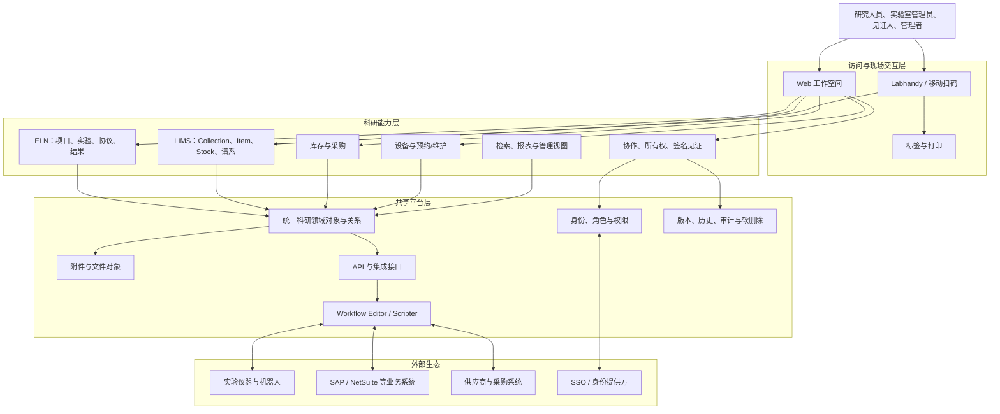

这张图是产品级逻辑架构，而不是厂商内部服务部署图。其最重要的含义是：ELN 与 LIMS 不是两个通过导入导出勉强连接的孤岛，而是建立在共享领域对象上的两个工作视角。Labguru 官方明确表述其原生 ELN 和 LIMS 模块共享一个数据库、无需中间件连接 `[官方]`。

## 5. 信息架构

### 5.1 工作空间与研究组织

```text
Workspace / Account
├── Members, roles and privileges
├── Projects
│   ├── Folder
│   │   ├── Subfolder
│   │   └── Experiment
│   │       ├── Section
│   │       │   ├── Text / note
│   │       │   ├── Protocol-derived procedure
│   │       │   ├── Sample / inventory element
│   │       │   ├── Plate layout / series
│   │       │   ├── Spreadsheet / result
│   │       │   └── Attachment
│   │       └── History / signature / witness
│   └── Project index and progress
├── Protocol library
├── Inventory collections
│   ├── Inventory item definitions
│   └── Physical stocks
├── Storage hierarchy
├── Equipment
├── Shopping / procurement
├── Workflow automation
└── Reports, search and administration
```

该层级来自 ELN tour、Project 演示、Experiment 演示与官方“Organizing your research data”帮助文档的交叉证据 `[视频][官方]`。

### 5.2 为什么 Project 不能等同于标签

Project 至少承担四类职责：

- 作为研究数据的访问和所有权边界。
- 聚合 Folder、Experiment 和相关对象。
- 提供项目索引页和进度视图。
- 为跨实验的结果、样本、附件和协作提供上下文。

因此，Project 更接近“有生命周期的研究工作区”，不是给实验加一个字符串分类。

## 6. 核心领域模型

以下 ER 图是基于产品行为抽象出的**概念模型**，并非 Labguru 私有数据库表结构。

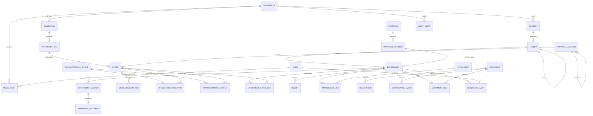

这一模型有三个设计重点：

1. **定义与实例分离**：Protocol 与运行中的 Experiment 分离；Inventory Item 与物理 Stock 分离。
2. **当前状态与历史事件分离**：Stock 当前数量/位置用于快速查询，Transaction/Event 保存其形成过程。
3. **内容与关系分离**：实验可以引用样本、库存、设备、结果和附件，不需要把所有内容压进一个富文本字段。

## 7. ELN 架构

### 7.1 Project → Folder → Experiment

Labguru 官方将科研记录组织为 `Project → Folder/Subfolder → Experiment` `[官方]`。Folder 不是纯视觉分组，它提供可扩展的中间层，使同一个项目能够按研究阶段、工作包、实验类型、批次或合作小组组织，而不必创建大量平级项目。

### 7.2 Protocol 是模板，Experiment 是执行记录

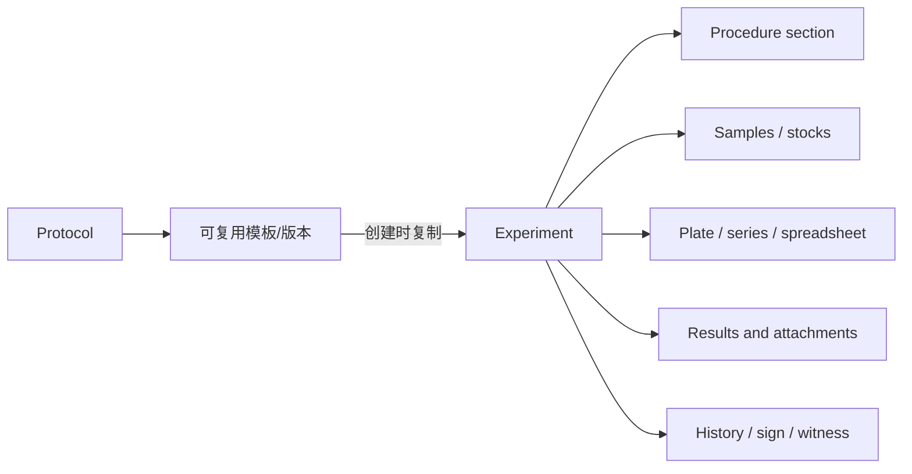

官方说明，用 Protocol 发起 Experiment 时，协议内容被复制到实验中，实验内的后续编辑不改变原始 Protocol `[官方]`。这是一种典型的“模板快照”设计，解决两类冲突：

- 实验需要忠实保留当时实际执行的版本。
- 协议库仍可继续迭代，不应篡改历史实验。

因此，正确的引用至少应记录 `source_protocol_id` 和 `source_protocol_version_id`，并在 Experiment 中保存不可被源模板覆盖的内容快照 `[推断]`。

### 7.3 Experiment 是结构化复合文档

“How to create the perfect experiment”展示了预设协议、Sample element、Plate layout、Series layout、Spreadsheet 和 Results `[视频]`。这说明 Experiment 不适合只建模为标题加若干长文本字段。

更合适的抽象是：

```text
Experiment
└── ordered Sections
    └── ordered Elements
        ├── RichTextElement
        ├── ProtocolStepElement
        ├── SampleElement
        ├── InventoryElement
        ├── PlateLayoutElement
        ├── SeriesElement
        ├── SpreadsheetElement
        ├── ResultElement
        └── AttachmentElement
```

Element 应具有稳定 ID、类型、顺序、结构化 payload、创建/修改人和版本信息 `[推断]`。若只存 HTML 或 JSON 大块，短期开发较快，但会削弱样本追踪、权限控制、差异比较、审计和跨实验查询。

## 8. LIMS 与库存架构

### 8.1 Collection → Item → Stock

Inventory Tour 的操作顺序是 Define Collections、Add Items、View Related Data、Create Stocks `[视频]`。官方帮助中心进一步区分：

- **Collection**：某类科研对象或库存对象的集合/模式，例如样本、抗体、质粒、化合物或自定义类别。
- **Inventory Item**：对象定义或目录记录，例如“某抗体、某细胞系、某试剂”。
- **Stock**：该 Item 的物理副本、管、瓶、孔或 aliquot，具有独立数量、位置、批次、状态和标识。

例子：

```text
Inventory Item: Anti-CHMP2A antibody, clone X
├── Stock A: lot 2026-01, 80 µL, Freezer 1 / Rack 2 / Box 4 / B3
├── Stock B: lot 2026-01, 100 µL, Freezer 1 / Rack 2 / Box 4 / B4
└── Stock C: lot 2026-07, 1 vial, Freezer 2 / Rack 1 / Box 8 / C2
```

该分层避免把“是什么”和“实验室里具体哪一份”混在一起。

### 8.2 Storage 是递归位置树

官方列出的 Storage 类型包括 Room、Shelf、Closet、Drawer、Refrigerator、Freezer、Rack、Slide rack 和 Other，并允许从宽到细构建层级 `[官方]`。

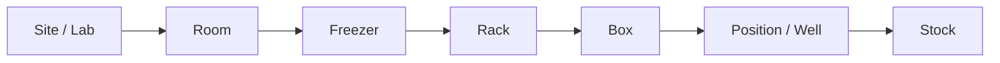

实现上宜将 Location 设计为递归树，并将盒内孔位作为可验证的位置坐标；位置移动必须同时产生库存事务或审计事件 `[推断]`。

### 8.3 Stock 事务模型

Stock 当前状态适合保存以下快照：

- 当前数量与单位。
- 当前 Storage 与具体位置。
- lot/batch、失效日期和状态。
- barcode/QR/DataMatrix 标识。
- 所有人、隐私或可见性状态。

但移动、消耗、补充、拆分、销毁、盘点修正和状态变化应另存不可变事件：

```text
StockTransaction
- stock_id
- event_type
- quantity_before / quantity_delta / quantity_after
- location_before / location_after
- actor_id
- experiment_id (optional)
- occurred_at
- reason / note
- source_system / workflow_run_id (optional)
```

Labhandy 官方文档展示了搜索/扫描 Stock、移动、挂接实验、消耗、复制、设置所有权和打印标签等操作 `[官方]`，这些操作天然对应事务或审计事件。

## 9. 样本谱系与 Pooling

Pooling 是判断 LIMS 模型是否成熟的关键案例。一个 pooled stock 可以来自多个 parent stocks；每个输入贡献不同体积或质量，并在指定时间由特定操作者完成。

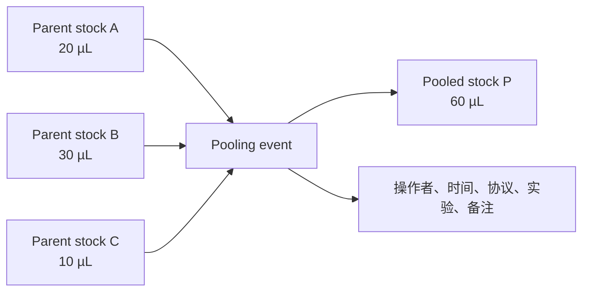

官方 Sample Pooling 文档说明系统记录 parent/derived links、用量、日期和 lineage `[官方]`。因此，单独的 `parent_stock_id` 只能表示一对多树，不能表达 pooling 的多输入、多输出或批次转换。

推荐的通用谱系结构是：

```text
TransformationEvent
├── TransformationInput(event_id, stock_id, quantity, unit, role)
└── TransformationOutput(event_id, stock_id, quantity, unit, role)
```

该结构还能统一表达 aliquoting、pooling、extraction、dilution、normalization、library preparation 和 plate transfer `[推断]`。

## 10. 标签、扫码与移动工作台

Labguru 支持为 stocks、plates、equipment 和 boxes 打印标签，并使用 Barcode、QR code 或 DataMatrix；标签可通过模板输出到 PDF 或打印机 `[官方]`。

其架构作用不是“多一个打印按钮”，而是建立三方绑定：

```text
数字对象 ID ↔ 机器可读标识 ↔ 物理容器/设备
```

Labhandy 将这套标识带到实验台边：用户可以扫描、筛选、移动、消耗、复制 Stock，并查看实验或协议内容 `[官方]`。因此移动端应被理解为 LIMS 的现场执行界面，而不是完整桌面端的简单缩小版。

需要注意：条码值必须稳定且唯一；标签重新打印不能创建新的业务对象；扫码动作应先解析对象，再依据权限决定允许的操作 `[推断]`。

## 11. 设备架构

公开视频和官网将 Equipment 作为独立能力域。合理的概念边界包括：

- Equipment 主数据：名称、类型、资产编号、位置、状态和负责人。
- Reservation：预约时间、使用人、项目/实验和冲突检查。
- MaintenanceEvent：校准、维护、故障、停用和证书附件。
- EquipmentUse：某次实验或自动化运行实际使用的设备。
- InstrumentIntegration：文件、结果或状态由仪器自动进入 Labguru。

公开视频能支持“设备与平台集成、设备属于独立模块”这一层结论 `[视频]`；上述完整字段与事件拆分属于目标领域模型 `[推断]`，不能声称就是 Labguru 私有表结构。

## 12. 自动化与集成架构

### 12.1 Workflow Editor

Labguru 官方 Workflow Editor 文档公开了以下能力：

- 触发方式包括手动、周期、Webhook 和外部触发。
- 工作流可包含顺序、并行和条件步骤。
- 支持变量与 Secrets。
- 每次运行具有状态、日志和输出。
- 工作流通过 API 与账户数据库中的对象交互。

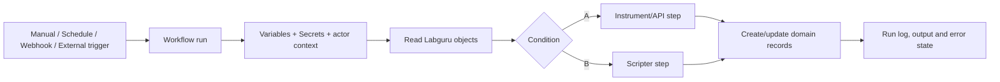

### 12.2 Scripter

官方 Scripter 文档说明脚本步骤可运行 Python 或 Ruby，并提供 token、base、GET/POST/PUT 等 API 辅助能力、变量与输出变量 `[官方]`。

这意味着自动化架构至少需要：

- 隔离的脚本执行上下文。
- 凭据/Secrets 管理。
- 运行超时、错误处理和日志。
- 对 Labguru API 的授权上下文。
- 可追踪的输入与输出变量。

是否使用容器、队列或特定沙箱技术属于 `[未知]`。

### 12.3 外部系统边界

公开视频显示的连接对象包括实验仪器、Opentrons、SAP、NetSuite、供应商生态和专用分析流程 `[视频]`。从架构上应将集成分为：

1. **主数据同步**：物料、供应商、用户、项目或设备。
2. **事务同步**：采购请求、订单、收货、库存变化。
3. **实验数据摄取**：仪器文件、板读数、分析结果。
4. **执行控制**：向机器人或仪器发送运行参数。
5. **通知与预警**：低库存、失效、失败运行或待审批事件。

每次集成写入都应标记 source system、external ID、workflow run 和幂等键，避免重复执行造成重复库存或结果 `[推断]`。

## 13. 身份、权限与合规治理

### 13.1 身份与成员关系

邀请队友的视频和官方 Account Admin 文档表明，Workspace/Account、User、Membership、Role/Privilege 是平台级对象 `[视频][官方]`。Project、Folder 和 Experiment 还可分配给同事或设置所有权 `[官方]`。

推荐的权限判定链为：

```text
User
→ Workspace membership and status
→ Global role/privileges
→ Project/folder/experiment ownership or sharing
→ Object-specific restrictions
→ Requested action
```

具体角色名和完整权限矩阵可能随套餐、配置或版本变化，本文不固化为私有实现事实。

### 13.2 版本、历史与软删除

Labguru 的 21 CFR Part 11 资料说明：修改进入 history、包含时间与用户；删除采用软删除；每次保存形成版本；签名和见证由两人完成；完成记录可生成锁定 PDF `[官方]`。

一个合规审计事件至少应包含：

```text
AuditEvent
- workspace_id
- actor_id
- action
- object_type / object_id
- version_before / version_after
- changed_fields or immutable diff
- occurred_at
- request/source context
- reason (when required)
```

普通业务日志、应用控制台日志和合规审计日志不是同一个东西。后者必须防止普通用户覆盖，并有明确保留策略 `[推断]`。

### 13.3 签名与见证

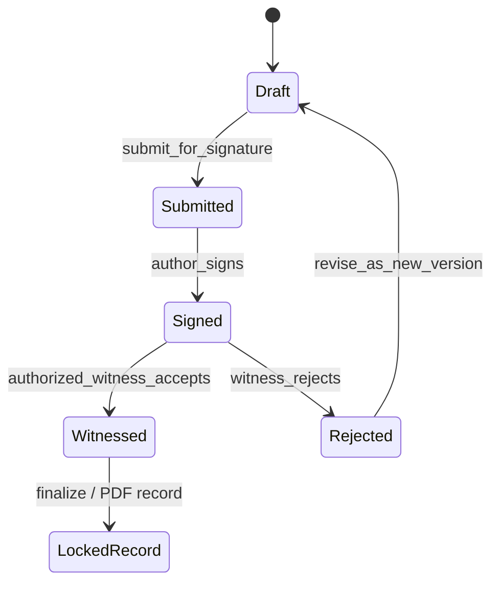

签名/见证应是带操作者、时间、角色、对象版本和理由的事件，而不只是 Experiment 上的两个布尔字段 `[推断]`。见证人权限也应与普通编辑权限区分 `[官方]`。

## 14. 文件、附件与结果

平台同时管理结构化关系数据和较大的附件/结果文件。官方 API 文档支持向 Experiment 上传文件 `[官方]`；云部署资料说明关系数据与 S3 对象存储分离 `[官方]`。

建议将其建模为：

```text
Attachment
- id, storage_key, filename, media_type, size, checksum
- created_by, created_at, malware_scan/status

AttachmentLink
- attachment_id
- object_type / object_id
- role (raw_data, result, certificate, image, protocol_file, ...)
```

同一附件可能需要关联实验、设备维护事件或结果，因此二进制对象与业务链接分离比在每张表保存文件路径更可扩展 `[推断]`。

## 15. 检索、报表与管理视图

Project index、progress、Related Data、库存筛选、移动端搜索和管理面板共同表明，平台需要跨对象检索和聚合视图 `[视频]`。

可以确认其产品能力，但无法从界面判断是否使用独立搜索引擎 `[未知]`。逻辑上至少需要：

- 对 Project、Experiment、Protocol、Item、Stock、Equipment 和附件元数据的统一检索。
- 按权限过滤结果，防止搜索侧信道泄露。
- 保存常用筛选、状态聚合和进度指标。
- 报表结果能够回溯到原始对象，而非形成脱离来源的复制数据。

## 16. 公开部署架构

### 16.1 AWS 公有多租户

Labguru 官方 Cloud Options 文档描述的公有云形态包括：共享计算资源、租户以不同 Amazon RDS SQL schema 进行逻辑隔离、租户使用独立 Amazon S3 bucket、传输中与静态加密，以及由 BioData 管理维护、监控、备份和灾难恢复 `[官方]`。

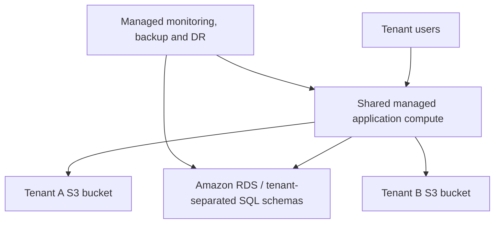

该图只表达官方公开的隔离边界。不能据此确定 RDS 引擎、应用实例数量、VPC 结构或服务拆分。

### 16.2 私有单租户

官方私有云选项包括 dedicated server、可选择 AWS region、dedicated S3 account 和更强的租户隔离，同时仍由 BioData 管理 `[官方]`。

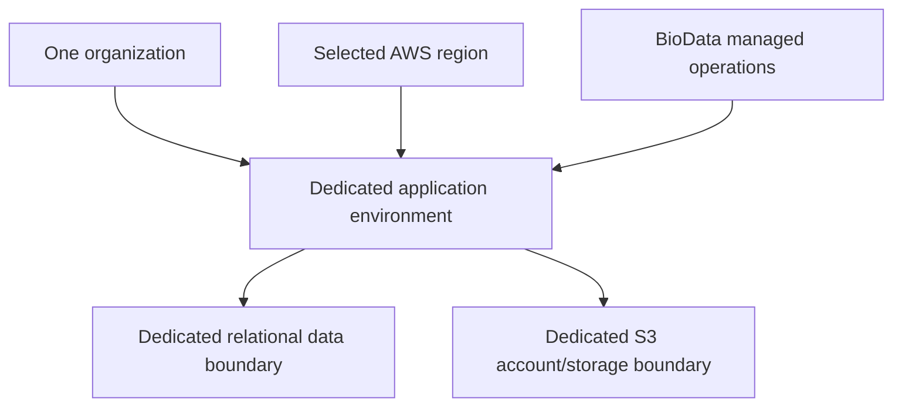

### 16.3 部署事实矩阵

| 问题 | 结论 | 证据等级 |
|---|---|---|
| 是否提供多租户云 | 是 | `[官方]` |
| 是否提供单租户私有云 | 是 | `[官方]` |
| 公有云是否共享计算 | 是 | `[官方]` |
| 租户关系数据是否逻辑隔离 | 是，以不同 RDS SQL schema 描述 | `[官方]` |
| 文件是否使用对象存储 | 是，官方描述 Amazon S3 | `[官方]` |
| ELN 和 LIMS 是否共享数据基础 | 是，官方称共享一个数据库 | `[官方]` |
| 核心数据库引擎 | 未公开 | `[未知]` |
| 单体还是微服务 | 未公开 | `[未知]` |
| 消息队列、缓存、全文检索产品 | 未公开 | `[未知]` |
| Workflow Scripter 语言 | Python、Ruby | `[官方]` |

## 17. 关键端到端流程

### 17.1 用 Protocol 创建 Experiment

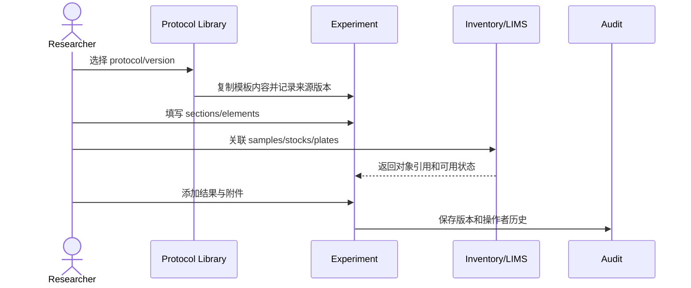

### 17.2 在实验中消耗 Stock

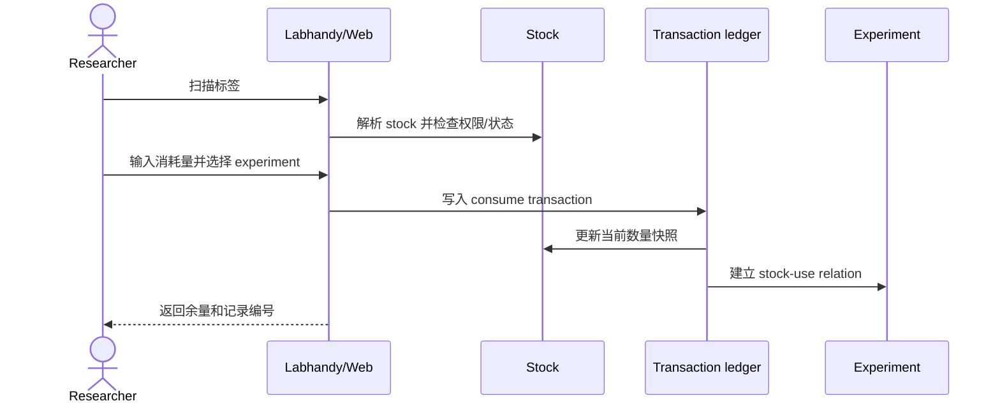

### 17.3 Pooling

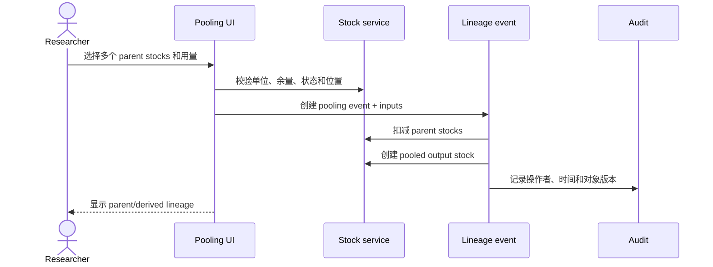

### 17.4 仪器结果自动回写

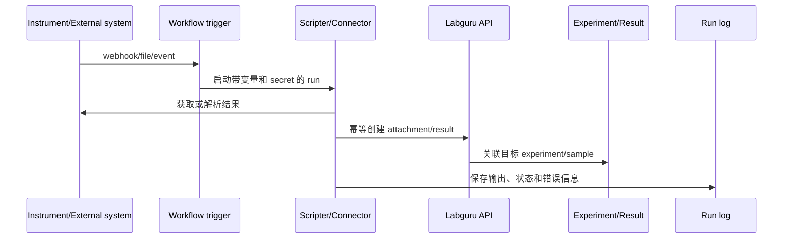

## 18. 已确认、可推断与未知项总表

| 架构层 | 已确认 | 合理推断 | 仍未知 |
|---|---|---|---|
| 产品 | ELN、LIMS、Inventory、Equipment、Automation、移动/标签、治理 | 统一平台服务支撑多个模块 | 内部服务数量 |
| ELN | Project/Folder/Experiment、Protocol、复合实验元素 | Section/Element 具有稳定结构化模型 | 私有字段和表结构 |
| LIMS | Collection/Item/Stock、Storage、Pooling | 事务账本与通用 transformation event | 实际库存事务实现 |
| 集成 | API、Workflow、触发器、脚本、日志 | 隔离执行、幂等键、secret vault | 队列和运行时实现 |
| 治理 | 用户、角色/权限、所有权、历史、版本、签名/见证、软删除 | 统一策略判定和不可变审计事件 | 权限引擎技术实现 |
| 存储 | RDS SQL 隔离、S3、共享数据库语义 | 关系数据与对象数据分层 | SQL 引擎、索引与缓存 |
| 部署 | AWS 公有多租户/私有单租户 | 分层网络和运维自动化 | VPC、容器、编排平台 |

## 19. Labguru 与 LabNest 当前模型映射

当前 LabNest 的领域模型见 [Prisma schema](../prisma/schema.prisma)，产品原则见 [README](../README.md)，项目工作区方向见 [ADR-0001](architecture/ADR-0001-weaver-ecology-project-workspace-architecture.md)。

| Labguru 概念 | LabNest 当前对象 | 对齐程度 | 主要问题或建议 |
|---|---|---:|---|
| Workspace / Membership | 尚无正式领域模型 | 低 | 增加 Workspace、User、Membership、Role/Privilege |
| Project | `Project` | 中 | 已有基本对象，但尚缺成员、状态聚合和项目级工作区边界 |
| Folder/Subfolder | 无 | 无 | 增加递归 `Folder`，Experiment 可归属 Folder |
| Experiment | `Experiment`、`ExperimentStep` | 中低 | 当前偏固定文本/步骤，需升级为 Section/Element 复合文档 |
| Protocol / version | `Protocol`、`ProtocolVersion` | 较高 | 已有版本基础；需明确发起实验时的不可变快照语义 |
| Protocol execution | `ProtocolRun` | 中高 | 可与 Experiment、实际步骤、库存消耗和结果进一步联结 |
| Inventory collection/item definition | `Entity`、`SampleProfile` | 中 | 可以承担科研对象定义层，但需要明确 collection/schema 语义 |
| Physical Stock | `InventoryItem` | 高但命名易混 | 其 barcode、lot、quantity、location、expiry 等字段更像 Labguru Stock |
| Storage | `InventoryLocation` | 高 | 已有递归层级；后续补位置约束、容器坐标和容量规则 |
| Stock transaction | `InventoryTransaction` | 高 | 坚持 transaction-first，并增强前后值、来源和幂等信息 |
| Lineage / pooling | `parentInventoryItemId`、`SampleLifecycleEvent` | 低到中 | 单 parent 无法表达多输入 pooling；需 TransformationEvent + joins |
| Result | `Result` | 中 | 需强化实验、样本/Stock、分析版本和附件的来源关系 |
| Attachment | `Attachment`、`AttachmentLink` | 高 | 当前方向正确；补 checksum、对象存储策略和安全状态 |
| Equipment | 仅 ProtocolVersion 中 JSON 等弱表达 | 低 | 增加 Equipment、Reservation、MaintenanceEvent、EquipmentUse |
| Procurement | `PurchaseRequest`、`ProcurementInquiry`、`ProcurementQuoteLine` | 中高 | 已有较好基础；后续与 Stock 收货及外部 ERP 事务贯通 |
| Audit | `ActivityLog` | 低 | 普通活动日志不足以承担版本差异、软删除、签名见证和合规审计 |
| Workflow automation | `ProposedAction` 等人工确认式 AI | 低 | AI 建议队列不等于触发器/步骤/运行日志组成的工作流引擎 |
| Sign / witness | 无正式模型 | 无 | 增加 SignatureRequest、SignatureEvent、WitnessDecision、locked version |

### 19.1 最重要的语义修正

LabNest 的 `InventoryItem` 实际上具有条码、aliquot code、lot、数量、位置、失效和冻融等物理字段，其语义更接近 Labguru 的 **Stock**，而不是 Labguru 的 Inventory Item。

短期不一定需要立即重命名数据库表，但服务层、界面和新模型应明确：

```text
Entity / SampleProfile = definition / scientific identity
InventoryItem          = physical stock / aliquot / vial
```

否则未来很容易在“同一种材料”和“同一种材料的三支管”之间产生数据混乱。

### 19.2 当前最大结构缺口

1. 缺 Workspace、Membership 和正式授权模型。
2. 缺 Folder/Subfolder 研究组织层。
3. Experiment 还不是可查询、可审计的结构化复合文档。
4. 单 parent 字段不能表达 pooling 和通用样本转换。
5. Equipment 尚未成为一等领域对象。
6. ActivityLog 不足以承担合规级版本、签名和见证。
7. ProposedAction 是人工确认式 AI 协作机制，不是通用 Workflow runtime。

## 20. 建议的 LabNest 目标架构

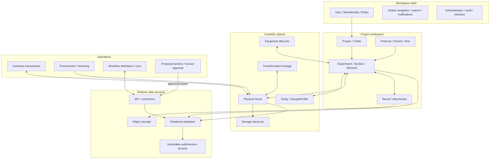

### 20.1 推荐模块边界

| 模块 | 主要职责 | 不应承担的职责 |
|---|---|---|
| Identity & Workspace | 登录、成员、角色、工作空间隔离 | 科研对象业务逻辑 |
| Project Workspace | Project、Folder、上下文导航和成员协作 | 全局身份管理 |
| ELN | Protocol、Experiment、Section/Element、结果记录 | 直接修改库存而不产生事务 |
| Scientific Registry | Entity、SampleProfile、命名和自定义属性 | 物理位置与数量 |
| Inventory/LIMS | Stock、Storage、Transaction、Lineage | 把对象定义重复复制到每支 Stock |
| Equipment | 设备、预约、维护、使用记录 | 通用采购流程 |
| Procurement | 需求、询价、报价、订单/收货接口 | 实验文档编辑 |
| Workflow | 触发器、步骤、运行、变量、Secret、日志 | 代替人工审批与合规签名 |
| AI Action | 生成建议、证据、差异预览和人工确认 | 绕过业务服务直接写数据库 |
| Governance | 权限、审计、版本、签名、保留策略 | 业务页面专有状态 |

### 20.2 建议新增的核心模型

```text
Workspace
User
WorkspaceMembership
Role / Privilege / PolicyBinding

Folder(parentFolderId, projectId)
ExperimentSection(experimentId, type, order)
ExperimentElement(sectionId, type, payload, order)

TransformationEvent(type, experimentId, protocolRunId, occurredAt)
TransformationInput(eventId, inventoryItemId, quantity, unit)
TransformationOutput(eventId, inventoryItemId, quantity, unit)

Equipment
EquipmentReservation
EquipmentMaintenanceEvent
EquipmentUse

WorkflowDefinition / WorkflowVersion
WorkflowTrigger
WorkflowRun / WorkflowStepRun
WorkflowSecretReference

AuditEvent
ObjectVersion
SignatureRequest
SignatureEvent
WitnessDecision
```

## 21. 分阶段实现路线

### Phase 0：保持当前产品原则并稳定数据边界

- 延续 LabNest 的 manual-first、AI subordinate 原则。
- 明确 `Entity/SampleProfile` 与物理 `InventoryItem` 的语义分工。
- 所有库存修改继续通过 `InventoryTransaction`，禁止页面直接静默改数量。
- 建立统一 service/API 写入边界，为审计和自动化留入口。

### Phase 1：研究工作区与结构化 Experiment

- 增加 Workspace/Membership 的最小模型。
- 增加 Folder/Subfolder。
- 将 Experiment 升级为有序 Section/Element。
- ProtocolVersion 发起 Experiment 时保存来源版本和内容快照。
- 将 Stock、Result、Attachment 作为结构化 Element 或显式关系挂入实验。

### Phase 2：LIMS 谱系与设备

- 引入 TransformationEvent/Input/Output，优先覆盖 pooling、aliquoting 和 extraction。
- 强化位置坐标、移动事务、盘点和条码唯一性。
- 将 Equipment、Reservation、MaintenanceEvent、EquipmentUse 变成一等对象。

### Phase 3：治理与可验证记录

- 建立策略化权限判定、对象版本和不可变 AuditEvent。
- 增加软删除、恢复和保留策略。
- 实现提交、签名、见证、拒绝、修订和锁定记录状态机。
- 明确普通 ActivityLog 与合规 AuditEvent 的不同保留和访问策略。

### Phase 4：自动化与外部生态

- 先实现 API/Webhook、WorkflowDefinition/Run/StepRun 和幂等写入。
- 再加入定时、条件、并行、Secrets 和脚本沙箱。
- 外部连接优先从最有价值、最可验证的场景开始，例如仪器结果回写或采购收货。
- AI 继续输出 ProposedAction，经人确认后调用相同业务服务；不建立绕过规则的第二写入通道。

## 22. 架构决策建议

### 22.1 应当借鉴 Labguru 的部分

- ELN 与 LIMS 共享领域对象，而非两个数据孤岛。
- Protocol 模板与 Experiment 执行快照分离。
- 对象定义与物理 Stock 分离。
- Storage 使用递归层级，Stock 变化采用事务记录。
- Pooling 使用多输入/多输出事件模型。
- 标签/扫码成为物理实验室与数字记录的连接层。
- 自动化必须有触发器、运行、日志、Secret 和 API 边界。
- 签名见证基于对象版本和事件，而非简单状态字段。

### 22.2 不应盲目复制的部分

- 不应仅凭视频外观复制页面布局，而忽略 LabNest 的本地优先和人工确认原则。
- 不应为追求“像企业 LIMS”一次性引入所有合规模块，导致核心实验流程不可用。
- 不应假设 Labguru 的内部技术栈就是最佳技术选型；该栈本身也没有公开。
- 不应把 AI 自动化等同于 Workflow；二者可以共享业务命令，但审批语义不同。
- 不应先做大量连接器再补幂等、审计和权限，否则外部写入会破坏数据可信度。

## 23. 风险与验证清单

在依据本文推进 LabNest 前，应逐项验证：

- Project/Folder 层级是否符合 LabNest 用户真实研究组织方式。
- Experiment Element 类型是否覆盖实际 wet-lab 记录，而不是只复刻演示视频。
- Stock 单位换算、负库存、并发消耗和盘点修正策略。
- Pooling 是否需要多输出、损耗、浓度、体积和单位转换。
- 设备预约、维护与仪器数据接入中，哪些是真实近期需求。
- 权限是工作空间级、项目级还是对象级；是否需要字段级限制。
- 审计、签名和数据保留是否有明确适用法规，而不是抽象“合规”。
- 工作流脚本的隔离、网络、Secret、超时、重试和成本上限。
- 文件对象的 checksum、病毒扫描、生命周期、备份和恢复演练。
- 多租户是否是 LabNest 的产品目标；若不是，不应为模仿竞品提前增加无收益复杂度。

## 24. 官方资料与来源

### 24.1 产品与信息架构

- [Labguru Products](https://www.labguru.com/products)
- [Labguru platform](https://www.labguru.com/)
- [Labguru ELN](https://www.labguru.com/eln)
- [Labguru LIMS](https://www.labguru.com/lims)
- [Labguru Inventory](https://www.labguru.com/inventory)
- [Labguru Equipment](https://www.labguru.com/equipment)
- [ELN–LIMS integration](https://www.labguru.com/glossary/eln-lims-integration)
- [Getting started with Labguru](https://help.labguru.com/en/articles/11991853-getting-started-with-labguru-a-quick-start-guide)
- [Organizing your research data](https://help.labguru.com/en/articles/2183911-organizing-your-research-data)

### 24.2 Experiment 与 Protocol

- [How to create an experiment](https://help.labguru.com/en/articles/8863742-how-to-create-an-experiment)
- [Creating and using protocols](https://help.labguru.com/en/articles/5469376-creating-and-using-protocols)
- [Protocol-initiated vs blank experiment](https://help.labguru.com/en/articles/6298125-using-a-protocol-to-initiate-experiments-vs-opening-a-new-blank-experiment)
- [Managing sections in experiments and protocols](https://help.labguru.com/en/articles/1492331-managing-your-sections-in-experiments-and-protocols)

### 24.3 Inventory、Storage、Pooling 与移动端

- [Inventory items and stocks](https://help.labguru.com/en/articles/1492345-inventory-items-and-stocks)
- [Inventory module and shopping list collection](https://help.labguru.com/en/collections/9329-inventory-module-and-shopping-list)
- [Storage types](https://help.labguru.com/en/articles/4322099-the-different-types-of-storages-in-labguru)
- [Sample pooling](https://help.labguru.com/en/articles/9734493-sample-pooling)
- [Printing labels](https://help.labguru.com/en/articles/5592354-printing-labels-in-labguru)
- [Scanning Barcode, QR code and DataMatrix](https://help.labguru.com/en/articles/2546791-scanning-barcodes-qr-codes-and-datamatrix-in-labguru)
- [Managing stocks with Labhandy](https://help.labguru.com/en/articles/6423669-managing-stocks-with-labhandy)
- [Getting started with Labhandy](https://help.labguru.com/en/articles/6412924-getting-started-with-labhandy)
- [View protocols and experiments with Labhandy](https://help.labguru.com/en/articles/10743676-view-entire-content-of-protocol-and-experiments-with-labhandy)

### 24.4 Workflow 与 API

- [Workflow Editor overview](https://help.labguru.com/en/articles/9053748-workflow-editor-overview)
- [Workflow Editor Scripter step](https://help.labguru.com/en/articles/6031756-workflow-editor-the-scripter-step)
- [Uploading files to experiments via API](https://help.labguru.com/en/articles/9636468-uploading-files-to-experiments-via-api)

### 24.5 身份、合规与部署

- [Cloud options](https://help.labguru.com/en/articles/5069601-labguru-cloud-options)
- [Security](https://www.labguru.com/company/legal/security)
- [Backup and security](https://help.labguru.com/en/articles/1492370-back-up-and-security)
- [Validated Cloud](https://www.labguru.com/validatedcloud)
- [Public-cloud SSO setup](https://help.labguru.com/en/articles/6012827-how-to-setup-single-sign-on-sso-login-in-the-public-cloud-environment)
- [Invite teammates](https://help.labguru.com/en/articles/7033874-how-to-invite-teammates-to-a-workspace)
- [Assign projects, folders and experiments](https://help.labguru.com/en/articles/1492380-assign-projects-folders-and-experiments-to-colleagues)
- [Signing, witnessing and rejecting documents](https://help.labguru.com/en/articles/5559237-signing-witnessing-and-rejecting-documents)
- [Witnessing privileges](https://help.labguru.com/en/articles/4866932-witnessing-privileges-in-labguru)
- [21 CFR Part 11](https://help.labguru.com/en/articles/1492369-21cfr-11)
- [Account Admin collection](https://help.labguru.com/en/collections/14641440-account-admin)

## 25. 最终判断

Labguru 可观察到的真正架构优势，不是某个单独页面或某项 AI 功能，而是围绕同一批科研对象建立了连续链条：

```text
计划与协议
→ 实验执行
→ 样本/Stock 使用
→ 位置与数量事务
→ 结果和附件
→ 谱系
→ 审计、签名与见证
→ API 和自动化
```

对 LabNest 最有价值的借鉴，是把这条链中的**对象身份、关系、事件和治理**建稳，同时保留 LabNest 已有的本地优先、manual-first、AI 需人工确认等产品原则。这样可以吸收 Labguru 的领域成熟度，而不必复制其界面，也不需要假装知道其未公开的私有技术实现。
